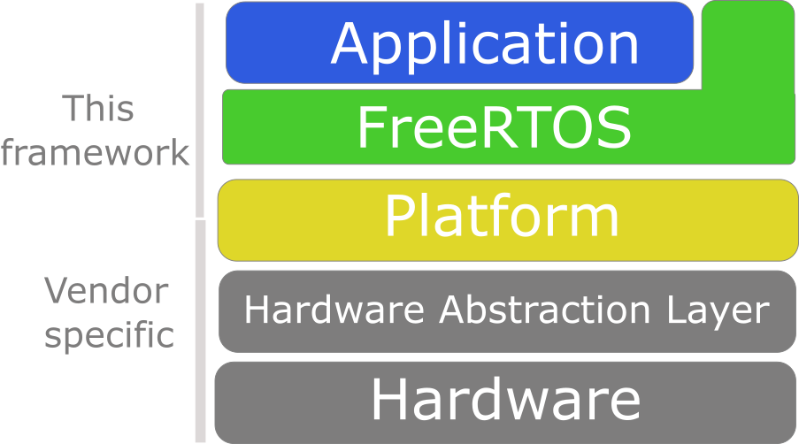
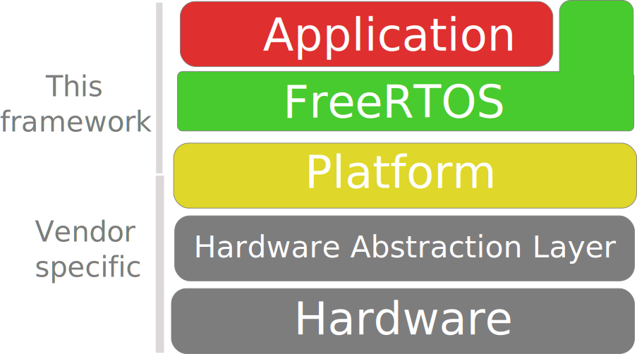
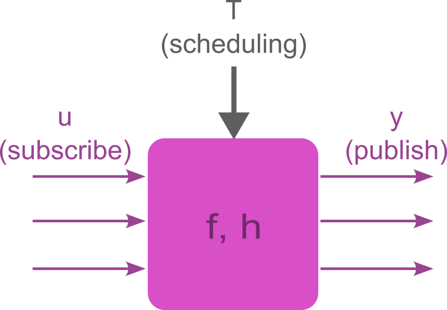
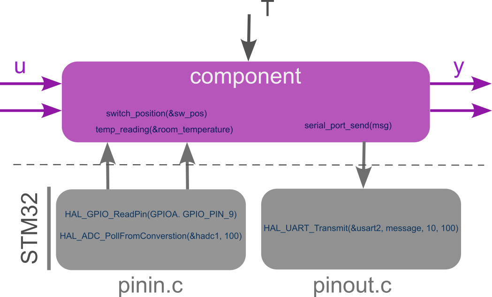
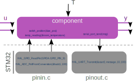

*Disclaimer: this is a work in progress. Everything may change at any time.
Also, consider that I am not a software engineering in a strict sense, but I am a control system engineer.
Finally, this is a perpetual on-going work and at the moment Arduino work is
left a bit behind, so don't use it.  *

# Motivation
Concurrency program is tough. Bugs are just behind the corner and having a bugs free software is practically impossible.
However, one may try to prevent the occurrence of such bugs by adhering to some coding rules and/or by following some standards.

Here, we aim at defining a software architecture that can help in preventing bugs when concurrency programming is employed.
We target STM32 F4 and Arduino platforms. For the Arduino platform we use
Platformio.

# Requirements

1. The toolchain of the platform that you are using,
2. pyserial.

*Optional*:

2. compiledb - for creating compile\_commands.json files.


# Architecture
The architecture is depicted below.
The idea is to abstract the application to allow its re-utilization on different platforms with as less pain as possible.
The OS used is FreeRTOS.

<!--  -->
<!-- *Cazzo figa culo deretano* -->

<div align="center">
  
  <p><em>Caption: Your caption text here</em></p>
</div>

The description of each layer is top-down.

## Application
The application is made by interconnected components that shall be platform
independent. That is, you can use the same components no matter is you are
using a STM32 or a Arduino board.
The same applies for the *utils* library.

Components communicates through a
*publisher/subscriber* model to resemble as much as possible Simulink models.
Each component has inputs `u`, outputs `y`, an internal state `x`, a state
transition function `f` and
an output function `h`, hence it resemble the classic Control Theory state
space form (or the Moore/Melay machines if you like it more), as it follows:

```
x[k+1] = f(x[k], u[k]),
y[k] = h(x[k], u[k]).
```

By traducing this boring math in Software Engineering language, and by
considering C as language reference, a component is a .c file that contains
the following:
1. Bunch of  global *static variables* representing the component state `x`,
2. *Init* function: to initialize the internal state, that is, our `x0`,
3. *Step* function: a function that update the internal state and produces the outputs, which is our `f`,
4. An optional output function that maps the state `x` to the output `y`.
5. *publish_/subscribe_* methods to publish/subscribe the outputs and inputs `y` and `u`.

That is, a component is *encapsulated* in a file and communicate with the
external world with its *publish* and *subscribe* functions.

> Example:
> Say that our application wants component A performs some sensor readings and
> wants to send the values over the serial port.
> In a classic scenario, component A should *#include* some header file that allows writing over the serial port.
> Instead here, Component A limits to publish the message it wants to send and nothing more.
> It is then from the serial port component (let's call it component B) that shall subscribe
> to the outputs of component A and then perform internally all the operations to send data over the serial port.

A corollary of the above is that the header files of each component must only contain the
declaration of the init
function, the step function, and the publish_/subscribe_ functions. Stop!


<!--  -->

<div align="center">
  
  <p><em>Caption: Your caption text here</em></p>
</div>

Finally, each component shall have an associated prefix to help the navigation
in the code-base.
In-fact, if we know the prefix of a subscribed signal, then we also know its
publisher. Handy!

### Components execution:
Components' input, state and output `u` `x` and `y` can be updated periodically or in an event-based fashion.
Periodic execution is performed through periodic tasks, whereas event-based
execution is achieved by deferring interrupts actions to some sleeping tasks
that wake up when some events occur.

To allow a bit of flexibility, the step functions take an argument to keep track of the component caller.
This because when running in periodic mode we may want the component to behave in a certain way,
but when we e.g. push a button to behave in a different way.

Once you have connected through their publish and subscribe functions, it is time to run them.
That is the topic of the next section.

Q: Among all the possible way of connecting blocks, is there any specific
guidelines? YES! See below.


### Application setup

In the *application_setup.c* file you do the following:

1. Initalize the components,
2. Define the periodic tasks (i.e. you set sampling period, allocated stack
   memory, etc),
3. For each periodic task you list the components that shall be executed.


## Operating system
The chosen operating system is FreeRTOS.
We use the one shipped with CubeMX and ArduinoFreeRTOS.
It takes a bit of application because components actually use freertos API.

## Platform

### pinin and pinout

To keep a minimum degree of flexibility among different hardware, the application software won't
directly call HAL functions of a specific platform, but instead it uses this
abstraction. For example, *pinin(&led\_state)* calls
e.g. *HAL_GPIO_ReadPin(...)* in STM32 and *digitalRead(...)* in Arduino.
However, the application shall not know about the underlying platform. A
component just calls *pinin(&led\_state)*.
The same for the pinout.

For GPIO pins interface it is enough to
include the appropriate pinin and pinout files in the build, depending if you
are using STM32 or Arduino platform.

Or, to use a more elegant solution, one may use function pointers. But I have
no time to go through that.


<!--  -->

<div align="center">
  
  <p><em>Caption: Your caption text here</em></p>
</div>

### Interrupts
Interrupts are used to perform some action in response to some event. Events can be
somehow "predictable" or "unpredictable".
An example of "predictable" event
is the end-of-conversion (EOC) of an ADC when ADC readings are requested by a
periodically scheduled task. In nominal conditions, we know more or less when
the EOC is going to happen, which is about every T seconds, being T the period of
the task. Another example is the event corresponding to a Timer that fires.
An example of unpredictable event is the pressure of a button connected to a
GPIO pin. We have absolutely no idea when such a button is going to be pressed.

In both cases, interrupt service routines (ISR) don't preempt the OS by executing some
arbitrary code, but they are gentle in the sense that they
wake up some task that will in turn execute some code code.
We say that interrupts *defer* functionality to tasks.
In this way, we only have to deal with tasks concurrency and not with a mixture of
interrupts/tasks concurrency that can be very nasty!

For this reason, ISR:s always have pretty much always the same structure regardless
of the nature of the event as well as the associated callbacks functions that only
perform the following operations:

1. Release a semaphore to unlock a task,
2. Ask for a context switch if the unlocked task has higher priority than the current task.

However, the difference relies in the following:

1. Predictable events assume that a periodic task is already running and it gets
   blocked while waiting for an event that will happen soon (an ADC reading
   to be
   completed, a Timer that fires, etc.). In this case the callback just release a
   semaphore to unlock the periodic task waiting for that event to happen and
   nothing more.
2. Unpredictable events. In this case the callback wakes up a specific task
   that performs the following actions:
    1. Publish few signals,
    2. Call all the components subscribed to such signals.

ISR and Callbacks for STM32 are defined in Core/Src/stm32fxx_it.c (so you must modify
that file), whereas for Arduino I don't know... yet.
To keep things separated, the functions implementing the deferred tasks for
unpredictable events are defined in the interrupts\_to\_task.c file.

Differently from pinin and pinout functions that we discussed above, interrupt
are tightly coupled to hardware so it appears very difficult if not impossible
to have a flexible solution for them. Hence, when switching platform, more
work is required to accommodate interrupts.


## Hardware


1. components header files shall only have:
2. A component can only belong to one task
3. Order the components calls
4. Interrupts must always be deferred to tasks.

ISR are always the same
subscribe methods return copies of signals' realizations.

At the bottom level we have the hardware. That can be whatever.
