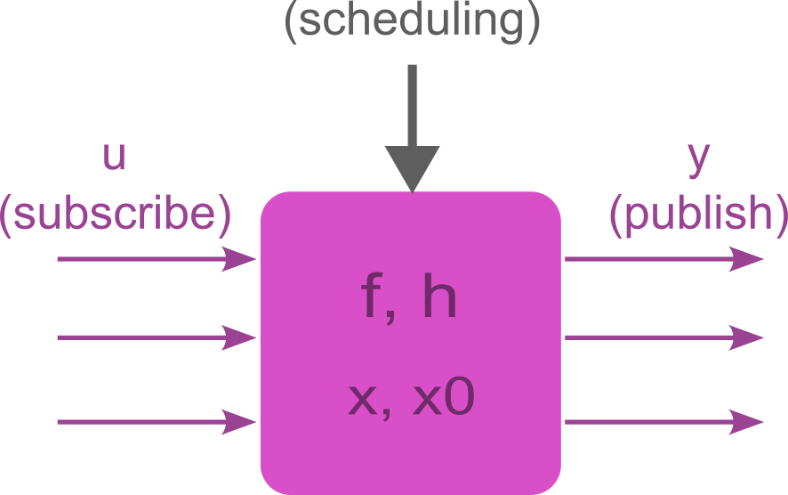

**Disclaimer**: _This is a perpetual work in progress. Everything may change
at any time. Also, consider that I am not a software engineering in a strict
sense, but I am a control system engineer._

# Welcome to DEFRECS!

DEFRECS stands for _DEvelopment Framework for Real-time Embedded Control
Systems_ and it is nothing more than a software architecture and a bunch of
guidelines to simplify and scale the development of real-time control systems
and to help control systems engineers to code their algorithms by using the C
language.

The architecture is an application of _component-based software engineering_
where the components communicate with a _publish/subscribe_ model and it
resembles as much as possible the so-called _model-based design_ which is the
paradigm used for example by Simulink. Here, we wish that developer still
thinks in terms of "connecting blocks" but instead of generating code from
them, they directly C-code them. Note that within this framework advanced
coding skills should not be required.

The proposed framework separates the application and the platform layers. The
aim is to make the application as portable as possible and the platform as
scalable as possible. For example, if you are working on a STM32 platform and
you want to move on an Arduino platform, the only layer that must be changed
is the platform layer, even if at the moment we develop it solely for STM32
platform.

## Getting started

The best way to play with this framework is to look at the
[examples](https://github.com/ubaldot/defrecs/tree/main/stm32f4x). The README
files therein contained describe the application and you can see how the
components are connected. The theoretical part that serve as basis for all the
examples is discussed in the reminder of this `README` file.

# Requirements

## STM32

For running the examples "as-is" you need a STM32F446RE Nucleo board. Hence,
you need the following software:

1. [CubeMX](https://www.st.com/en/development-tools/stm32cubemx.html) for
   generating the firmware,
2. [CubeCLT](https://www.st.com/en/development-tools/stm32cubeclt.html) which
   is the IDE if you use third-party tools.

If you want, you can also install
[CubeIDE](https://www.st.com/en/development-tools/stm32cubeide.html) to have
all in one. However, if you go for this solution you should add the include
paths and the source code files to be compiled.

## ESP32

TBD.

## Optionals

There are other tools that I personally use:

1.  [pyserial](https://github.com/pyserial/pyserial) for interacting with the
    serial port of your laptop,
2.  [compiledb](https://github.com/nickdiego/compiledb) for creating
    `compile_commands.json` files in case you use some LSP like
    [clangd](https://clangd.llvm.org/),
3.  [State Smith](https://github.com/statesmith/statesmith) for generating
    code for finite state-machines (ok, I don't use it yet, but I plan to
    investigate its potential).

If you write the platform for other boards feel free to open a PR and if you
are eager to start, jump to the _How to use_ Section below.

It is also required that users know basic concepts of operating systems such
as what is a tasks, what are race-conditions, what are mutexes as well as some
basics of micro-controllers such as what is an interrupt, etc.

# Repository structure

On the top level you have each folder representing each platform. As it is
today, we only have one platform folder (e.g. `stm32f4x`). Each sub-folder
represents an example (e.g. `Hello_World`, `ADC_Readings`, etc.). You also
have some additional files that you could ignore as they are using for the
debugging framework used by the author.

    defrecs
        └── stm32f4x
            ├── Hello_World
            │   ├── application
            │   ├── platform
            │   ├── utils
            │   ├── contrib
            │   └── ... other platform specific folders
            └── ADC_Readings
                ├── application
                ├── platform
                ├── utils
                ├── contrib
                └── ... other platform specific folders

The structure of each example is always the same: you have an `application`
folder that contains a selection of application components, and a `platform`
folder that contains platform components. Among other things, the platform
components are in charge of wrapping the HAL of a specific vendor, in this
case STM32.

The components in the `application` folder shall be platform independent. They
shall never directly call HAL functions. At most, they call OS functions.

Given that your task is 90% developing and connecting components, you will
work 90% of your time with the files contained in these two folders.

However, there are some other folders and files. For example, there is a
`utils` folder that contains a number of utilities, like for example the
`ftoa` used to convert floats into ASCII in embedded systems, that you may
want to re-use in your components.

There is a `contrib` folder that you can ignore as it contains helpers from
third-parties, for example for accessing FreeRTOS tasks through _openocd_ when
you are debugging and so on.

Finally, there are a bunch of other folders which are platform/framework
specific or are files that the author uses (like `opendocd_*` files etc) that
you can simply ignore.

Note that each example has a `README.md` file that explains what has been
done.

Again, you will most likely use only the `application` and the `platform`
folders even though sometimes you need to do some adjustments here and there.

### stm32f4xx

In the STM32 case, you have a bunch of folders (`Core`, `Drivers` and
`Middleware`) that are automatically generated by CubeMX. They contain the
board firmware and FreeRTOS.

You also have a `Makefile` which is originally generated by CubeMX and then it
has been slightly edited.

For more details, check the examples.

# Architecture

The proposed architecture is depicted below. The idea is to abstract the
application to allow its re-utilization on different platforms with as less
pain as possible. The OS used is FreeRTOS.

<div align="left">
  
</div>
<div align="center">
  <p><em>The proposed architecture.
<br>
  The OS layer span a bit over the application layer because the latter makes
  direct calls to FreeRTOS API.
  This means that you cannot replace such layers independently.</em></p>
</div>

## Application Layer

The application is made by interconnected components stored in the
`application` folder. A component could be a PI controller, a Kalman filter, a
sensor reader, a finite-state machine and so on and so forth. The aim is to
make components platform-independent and to allow users to connect them in an
easy manner. To achieve such a goal, components communicates one each other
through a _publisher/subscriber_ model to resemble as much as possible
Simulink models.

<div align="center">
  
  <p><em>Application example.
  <br>
  Components are connected through subscribe (inputs) and publish (outputs)
  functions.
   </em></p>
</div>

Each component has inputs `u`, outputs `y`, an internal state `x`, a state
transition function `f` and an output function `h`. Hence each component can
be seen in classic Control Theory state space form (or the Moore/Melay
machines if you like it more), as it follows:

```
x[k+1] = f(x[k], u[k]),
y[k] = h(x[k], u[k]).
```

By traducing this boring math in Software Engineering language, and by
considering C as language reference, a component is nothing more than a
`.h,.c` pair that contains the following:

1. _Static variables_ representing the component state `x`,
2. _Init_ function: to initialize the internal state, that is, our `x0`,
3. _Step_ function: a function that update the internal state and produces the
   outputs, which is our `f`,
4. _Output function_ that maps the state `x` and the input `u` to the output
   `y`.
5. _publish*/subscribe*_ functions to publish/subscribe the outputs and inputs
   `y` and `u`.

That is, a component is _encapsulated_ in a file and communicate with the
external world with its _publish_ and _subscribe_ functions.

<div align="center">
  
  <p><em>A component.
  <br> It has an internal state x, input u and output y, it is
  initialized with initial condition x0 and it can be scheduled periodically
  or in an event-based fashion. The step function (aka state-transition
  function) and the output function are f and h, respectively.
  A component is encapsulated in a .h,.c pair. </em></p>
</div>

> Example: Say that our application wants component A performs some sensor
> readings and wants to send the values over the serial port. In a classic
> scenario, component A should _#include_ some header file that allows writing
> over the serial port. Instead here, Component A limits to publish the
> message it wants to send and nothing more. It is then from the serial port
> component (let's call it component B) that shall subscribe to the outputs of
> component A and then perform internally all the operations to send data over
> the serial port.

### Components implementation

It follows a checklist for components implementation:

1. Each internal state `x` must have an associated mutex,
2. Each output must have both a _publish_ and a _subscribe_ function. The
   publish function is used internally to update the output and the subscribe
   is exposed to other components.

> **Example**
>
> If output `y` of component A is used as input of component B, then component
> A must implement both a publish and subscribe function for `y`. The publish
> function is kept internal to component A (in-fact it is declared as
> `static`) whereas the subscribe function is included in `componentA.h`.
> Next, `ComponentB.c` shall include `componentA.h` and now `ComponentB` can
> read `y` as input by simply call the subscribe function.
>
> The output function `h(x,u)` can be implemented either inside the publish or
> the subscribe function.

> [!TIP]
>
> The definitions of the publish and subscribe function is always the same.
> The only thing that changes is the dimension in the `memcpy` function. In
> the future we may thing to automatically generate that part of code based on
> some `.yaml/.json` file used to configure the input and output of the
> components.

3. Header files of each component must only contain the declaration of the
   init function, the step function, and the subscribe functions.

   1. The `*_init()` function is called by `application_setup.c` file,
   2. The `*_step(WhoIsCalling caller)` is called by `application_setup.c` and
      by some deferring tasks defined in `interrupts_to_tasks.c` file,
   3. The `subscribe_*` functions are called by all the components that take
      those outputs as inputs.

4. Due to that C language does not have namespaces, each component shall have
   an associated prefix,
5. Don't forget to initialize and schedule your component from the
   `application_setup.c` file.

### Components execution

Components' input, state and output `u` `x` and `y` can be updated
periodically or in an event-based fashion. Periodic execution is performed
through periodic tasks, whereas event-based execution is achieved by
interrupts. More precisely, _Interrupts Service Routines_ (ISR:s) wake up
dedicated, sleeping tasks that will carry out the actual work needed.

To allow a bit of flexibility, the step functions take an argument to keep
track of the component caller. This because when running in periodic mode we
may want the component to behave in a certain way, but we may want it to
behave differently in response to a sudden event, e.g. when a button connected
to some GPIO is pressed.

However, given that the component can be called periodically and in response
to an event, both the subscribe and publish functions are always protected by
a mutex to avoid race conditions.

Once we have connected your selected components through their publish and
subscribe functions, it is time to run them. That is the topic of the next
section.

### application_setup.c

We have connected our components. The data flow is clear. Next, we have to
schedule our components. In the `application_setup.c` file you do the
following:

1. Initalize the platform and the components,
2. Define the periodic tasks (i.e. you set sampling period, allocated stack
   memory, etc),
3. For each periodic task you list the components that shall be executed.

## Operating System Layer

The chosen operating system is FreeRTOS. In the examples, we use the one
shipped with CubeMX. In the picture at the beginning of this document, the OS
takes a bit of application because components actually use FreeRTOS API.

Why use a RTOS is well explained in the FreeRTOS homepage, whereas it has been
recently released a new FreeRTOS guideline.

However, regardless of the used OS, it is good to know general concepts such
as tasks, interrupts, interrupt-service-routines (ISR) and the problems that
may arise when using a RTOS. The way we are using the OS in DEFRECS should -
hopefully - minimize all the occurrence of all the problems introduced by the
usage of a RTOS.

We consider only two types of tasks: periodic and deferring. The first
schedule components in a periodic fashion, whereas the second are woken up in
response to an unpredictable event that has occurred. See interrupt Section
below for more information.

We further carefully uses mutex to avoid blocking conditions and starvation.

## Platform Layer

In the `platform` folder there are stored all the components that make calls
to the HAL layer. If you are changing platform you have to only have to adjust
the files here, leaving the application untouched.

As in the application layer, the platform components have states, inputs,
outputs, an init function, a step function, etc.

### Interrupts

Interrupts are used to perform some action in response to some event. Events
can be somehow "predictable" or "unpredictable". An example of "predictable"
event is the end-of-conversion (EOC) of an ADC when ADC readings are requested
by a periodically scheduled task. In nominal conditions, we know more or less
when the EOC is going to happen, which is about every _T_ seconds, being _T_
the period of the task. Another example of predictable event is the event
corresponding to a Timer that fires. An example of "unpredictable" event is
the pressure of a button connected to a GPIO pin. We have absolutely no idea
when such a button is going to be pressed.

In both cases, interrupt service routines (ISR:s) don't preempt the OS by
executing some arbitrary code, but they are gentle in the sense that they wake
up some task that will in turn execute some code code. We say that interrupts
_defer_ functionality to tasks. In this way, we only have to deal with tasks
concurrency and not with a mixture of interrupts/tasks concurrency that can be
very nasty!

For this reason, ISR:s always have pretty much always the same structure
regardless of the nature of the event as well as the associated callbacks
functions that only perform the following operations:

1. Notify a deferring task that wakes up,
2. Ask for a context switch if the woken up task has higher priority than the
   current task.

However, the difference relies in the following:

1. _Predictable_ events assume that a periodic task is already running and it
   gets blocked while waiting for an event that will happen soon (an ADC
   reading to be completed, a Timer that fires, etc.). In this case the
   callback notifies the locked periodic task waiting for that event to happen
   and nothing more.

> **Example**
>
> Assume that `my_component` is scheduled in `task_200ms` and that
> `my_component` reads data from ADC that transfer the converted data to
> memory through the DMA. In the following code:

```
// ...
HAL_ADC_Start_DMA(&hadc1, analog_read, NUM_CHANNELS);
ulTaskNotifyTake(pdTRUE, portMAX_DELAY);
// ..
```

> the function `ulTaskNotifyTake()` locks the task `task_200ms` until it
> receive a notification. Such a notification is send from the callback
> function invoked when the "DMA transfer completed" event happened.

2. _Unpredictable_ events. In this case the callback wakes up a specific task
   that calls the components with a specific caller argument.

ISR:s and Callbacks for STM32 are defined in `Core/Src/stm32f4xx_it.c` (so you
must modify that file), whereas for Arduino I don't know... yet. The functions
implementing the deferred tasks for unpredictable events are defined in the
`interrupts_to_task.c` file. When dealing with HAL functions that trigger
interrupts, check these three files: the function that calls the HAL function,
the `Core/Src/stm32f4xx_it.c` and the `interrupts_to_tasks.c`.

## Hardware Layer

At the bottom level we have the hardware that is what you plan to deploy your
code.

# How to use?

The best is to copy an example and adjust it based on your need. For each
example you have an associated `README.md`file with the following structure:

1. Introduction
2. Requirements - what the system shall do.
3. Implementation
   1. Hardware - which pin corresponds to what, etc.
   2. Software - how components are connected.
      1. Platform - platform components description, predictable and
         unpredictable events.
      2. Application - application components description.
      3. Scheduling - how components are scheduled

The process for modifying an existing example is fairly easy:

1. Open the `.ioc` file with CubeMX and adjust your hardware configuration.
   Generate the `Makefile` from there: in the Section
   `Project Manager - Project - Toolchain/IDE` select `Makefile`,
2. Adjust the `Makefile` to include your tools path and the source and include
   paths,
3. Adjust the platform layer components located in the `platform` folder,
4. Develop and connect your components in the `application` folder, through
   publish/subscribe functions,
5. Schedule the components in the `application_setup.c` file,
6. Adjust the code for handling interrupts, if any.

## Application design

1. Start your project by adjusting the platform components. Don't forget to
   initialize them and to schedule them from the `application_setup.c` file,
2. You only have two types of tasks: _periodic_ tasks defined in
   `application_setup.c` and _deferring_ tasks called by ISR:s which are
   defined in `interrupts_to_tasks.c`. Deferring tasks wake up sporadically,
   i.e. upon Interrupt-Service-Routine (ISR) call, so they are not periodic,
3. ISR:s shall always be deferred to tasks,
4. A component should be scheduled only in one periodic task. Avoid calling
   the same component from different periodic tasks. However, an already
   scheduled components can be called by a deferring tasks,
5. Never use HAL functions in the application layer,
6. Components shall communicate only through their publish/subscribe
   interfaces,
7. Pay attention to your components scheduling. Some outputs may be sampled
   faster or slower than some inputs and that could lead to a number of
   problems. Be sure that the scheduling makes sense to your application.

## Components design

1. Each component must have a prefix, to be easily searched,
2. Published signals must start with the prefix, e.g. `blink_led_state`,
3. Each published/subscribed is protected through a mutex,as well as HAL calls
   (think for example if some usart component that transmit data is called
   concurrently),
4. Mutex for publishing/subscribing must contain the same name of the
   associated output, e.g. `blink_led_state` -> `mutex_blink_led_state`
5. Publish and subscribing functions is the same for all the components and
   must have the form `publish_<output_name>(...)`, e.g.
   `publish_blink_led_state(&led_state)`,
6. The function to be placed in the scheduling must have the form
   `<prefix>_step`, e.g. `blink_step(PERIODIC_TASK)`,
7. Outputs shall be initialized in the `<prefix>_init()` function,
8. Component header files must include only the prototypes of the init, the
   step and the subscribe functions.

Once done, edit the `Makefile` and you are set. For STM32 you have to modify
the _Programmer and compiler paths_ and the _Custom targets_ sections.

<div align="center">
  
  <p><em>Scheduling example. Check that the execution periods won't mess up
  your application.
   </em></p>
</div>

# Application Software Architecture

TBD

# Motivation

Concurrency program is tough. Bugs are just behind the corner and in many
cases it is hard to detect them. This issue is even more emphasized for those
who are not strict software developers, like for example control systems
engineers. However, one may try to prevent the occurrence of bugs by adhering
to some coding rules and/or by following some standards.

Here, we aim at defining a software architecture and some guidelines that can
help in preventing bugs when concurrency programming is employed. Furthermore,
the proposed architecture allows different people working on different
components without the risk of interfering one each other. For example, one
person may work in designing a PID controller, another person or team in
developing a Kalman filter for estimating some quantities, etc.

## TODO:

1. cmake and/or function pointers to deal with cross-platform.
2. HAL and OS Error handling.
3. Doxygen.
4. Components vs "utils" functions.
5. Generate interfaces from yaml.
6. Keep the components in a common top folder and link them from the Makefile
   of each example (how to deal with compile_commands.json file then?)
7. Investigate if you can use vanilla FreeRTOS to make it even more platform
   independent.
