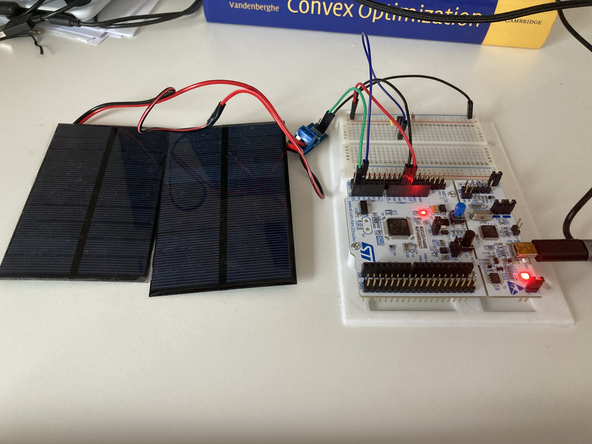
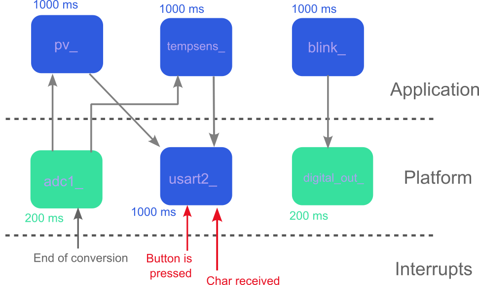

# ADC reading

In this example we add the utilization of the ADC converter and we require
something slightly more complex to the system.

  

  
<em>ADC reading example setup.  </em>

# Requirements:

The "system" shall behave as it follows:

1. The builtin led blinks every second,
2. Two sensors are connected to the ADC1, but:
   1. The values of the first sensor are sent periodically over the USART2,
   2. The values of the second sensor are sent over the USART2 only when the
      builtin button is pressed.
3. User can type anything on its computer keyboard. Once `Enter` is pressed,
   the message is sent through the USART2.

We used two small photo-voltaic panels connected in series and a LM335
temperature sensor as sensors. Feel free to replace these sensors with
whatever you want, but mind that you must have to create two new application
components and adjust the publish/subscribe links, see picture below.

# Implementation

## Folder structure

The folders starting with a Capital letter are generated by CubeMX. The most
important folders are **platform** and **application** folder. They contain
all the components.

You also have a `.ioc` file to be opened with CubeMX and a `Makefile` that you
may need to change especially in the **Programmer and compiler path** Section
and down in the **clean up** Section.

Note how each component specify publish and subscribe functions for reading
inputs and writing outputs, how they have an init and a step function and how
mutex are used. Note how the structure of both publish and subscribe functions
is the same: you have a mutex and you use a `memcpy` depending on the size of
the signal you want to publish.

However, note that the publish function is defined as static and it does not
appear in the component `.h`file. Could you answer why? And why the internal
state of a component is also defined as static?

In the `application_setup.c` function you can see how the components are
scheduled. Feel free to play around at you wish.

## Hardware

The first sensor is connected to `PC0` whereas the second is connected to
`PC1`. The Nucleo board is connected to the PC.

## Software

The component view is the following:

  

  
<em>ADC Reading example software architecture.
  We can see how the components are connected, how they are
  scheduled and we can also see the predictable and the unpredictable events.
  </em>

### Platform

We only use a `usart2_`, `adc1_` and `digital_out_` components. These
components calls HAL function and publish signals that the application
components can subscribe to or they are subscribed to application components.

We have the following _interrupts_:

- Predictable event:

  1. "ADC1 end-of-conversion",

- Unpredictable events:
  1. "Builtin button is pushed",
  2. "A character is received over the USART2".

In the first case, the Callback function associated to the ISR notify a
blocked periodic task, whereas in the latter case the work is deferred to two
deferring tasks. Such deferring tasks are defined in `interrupts_to_task.c`

Note that only platform components are allowed to make HAL API calls.

### Application

The `blink_` does not subscribe anything but it publishes its state. The
`digital_out_` subscribe that signal.

The `pv_` and `tempsems_` components interpret the pin voltages encapsulated
in the published signals from `adc1_` and publish a value. The component
`usart2_` subscribe these signals.

### Scheduling

There are only two periodic tasks: one running at 1000ms and the other at
200ms. However, there are also two deferring tasks associated to the
unpredictable events. Such deferring tasks call the `usart2_` component.
