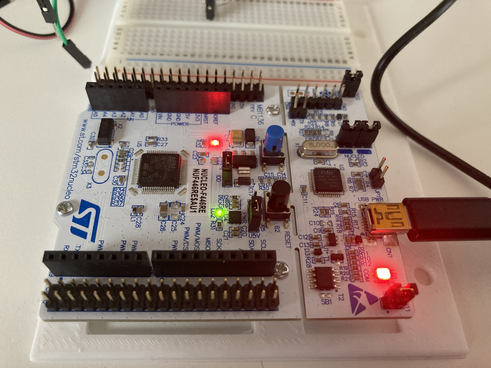
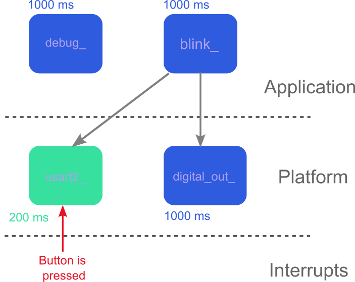

# Hello World!

This is a very simple example to show the basics of DEFRECS.

  

  
<em>Blink setup.  </em>

# Requirements:

The "system" shall behave as it follows:

1. The builtin led blinks every second,
2. The led state is sent over the USART2,
3. Every time the builtin button is pressed, the string `Hello World"` is sent
   over the USART2.

# Implementation

## Folder structure

The folders starting with a Capital letter are generated by CubeMX. The most
important folders are **platform** and **application** folder. They contain
all the components.

You also have a `.ioc` file to be opened with CubeMX and a `Makefile` that you
may need to change especially in the **Programmer and compiler path** Section
and down in the **clean up** Section.

Note how each component specify publish and subscribe functions for reading
inputs and writing outputs, how they have an init and a step function and how
mutex are used. Note how the structure of both publish and subscribe functions
is the same: you have a mutex and you use a `memcpy` depending on the size of
the signal you want to publish.

However, note that the publish function is defined as static and it does not
appear in the component `.h`file. Could you answer why? And why the internal
state of a component is also defined as static?

In the `application_setup.c` function you can see how the components are
scheduled. Feel free to play around at you wish.

## Hardware

Nothing is really done since in Nucleo boards both the LED and the button are
builtin. However, if you decide to port this example on another platform, you
may need to connect an external button and LED to your board.

## Software

The component view is the following:

  

  
<em>Hello world example software architecture.
  We can see how the components are connected, how they are
  scheduled and we can also see the unpredictable events.
  </em>

### Platform

We only use the `usart2_` and the `digital_out_` components. These components
calls HAL function and subscribe to signals published by application
components.

We have the following _interrupts_:

- Predictable event:

  1. None

- Unpredictable events:
  1. "Builtin button is pushed",

The deferring task associated to the unpredictable event is defined in
`interrupts_to_task.c`.

Note how `usart2_` is called from both periodically and from an ISR and how
the case is simply handled by a switch condition on the caller.

Finally note that only platform components are allowed to make HAL API calls
and how they are protected with a mutex in case of potential concurrency, as
done in `usart2_`

### Application

The `blink_` does not subscribe anything but it publishes its state. The
`digital_out_` subscribe that signal.

We further have a `debug` component that does not publish nor subscribe any
signal but it is handy for visualizing the system state when debugging with
e.g. `gdb`.

### Scheduling

There are only two periodic tasks: one running at 1000ms and the other at
200ms. However, there are also two deferring tasks associated to the
unpredictable events. Such deferring tasks call the `usart2_` component.

### Conclusions

This was a truly just `Hello World` example, but it exhibit many aspects of
DEFRECS. In particular, it is shown:

1. how the system is broken down into components,
2. how components are grouped into platform and application (Note: only
   platform components call HAL function, so if you can swap to an e.g.
   Arduino board all you have to do is to adjust the platform layer, leaving
   the application untouched),
3. how interrupts are handled,
4. how simple is to sketch a block diagram in a Simulink-like style,
5. how the publish/subscribe mechanism work,
6. how to use mutexes for protecting internal components state and HAL calls.

I hope you enjoyed it!
